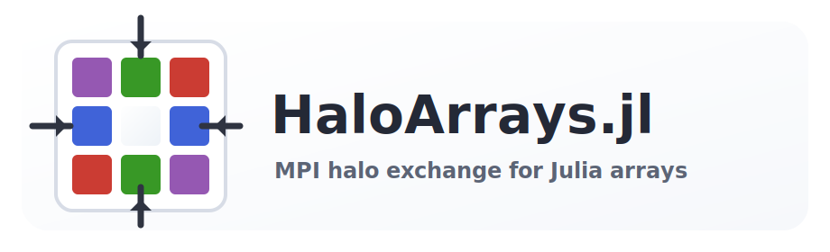

<p align="center">
  
</p>

# HaloArrays.jl

`HaloArrays.jl` provides MPI-aware Julia arrays with halo, or ghost, cells for
structured-grid stencil codes.

It is designed for rank-local stencil kernels: each MPI rank owns a dense local
interior, `HaloArray` stores halo cells around that interior, and `haloswap!`
exchanges boundary data with Cartesian neighbours.

## Main Features

- Dense local arrays with symmetric halo cells.
- Natural halo indexing such as `a[0, j]` and `a[nx + 1, j]`.
- Interior-only Julia iteration and broadcast.
- Blocking and non-blocking MPI halo exchange.
- Face-only exchange by default, with staged wider exchange for corner-reading
  stencils.
- Explicit physical boundary handling for non-periodic domains.

## Documentation

The manual and API reference are available through GitHub Pages:

https://davide-lasagna-s-lab.github.io/HaloArrays.jl/stable/

## Quick Example

```julia
using MPI
using HaloArrays

MPI.Init()
try
    a = HaloArray{Float64}(
        MPI.COMM_WORLD,
        (2, 2),          # Cartesian process grid
        (true, true),    # periodic in both dimensions
        (64, 64),        # local interior size per rank
        (1, 1),          # halo width
    )

    a .= MPI.Comm_rank(comm(a))
    haloswap!(a)

    nx, ny = size(a)
    out = similar(a)
    for j in 1:ny, i in 1:nx
        out[i, j] = a[i - 1, j] + a[i + 1, j] +
                    a[i, j - 1] + a[i, j + 1] -
                    4a[i, j]
    end
finally
    MPI.Finalize()
end
```

Run MPI examples with:

```bash
mpiexec -n 4 julia --project=. stencil.jl
```

## Installation

```julia
using Pkg
Pkg.add(url="https://github.com/Davide-Lasagna-s-Lab/HaloArrays.jl")
```

## Development

```bash
julia --project=. -e 'using Pkg; Pkg.test()'
```
